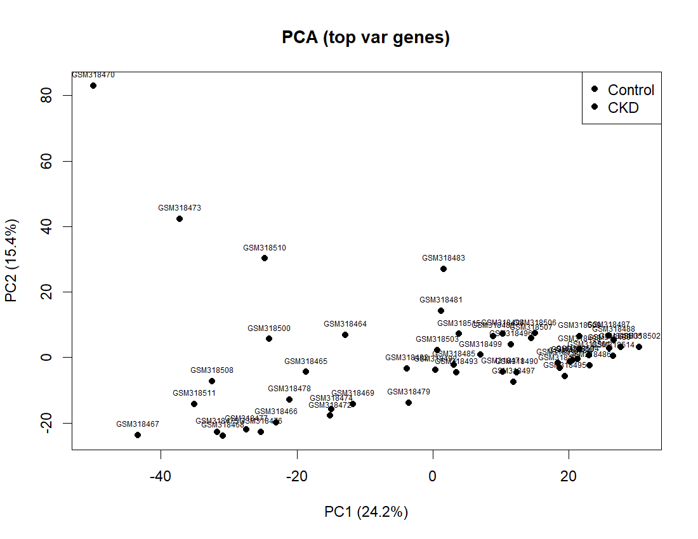
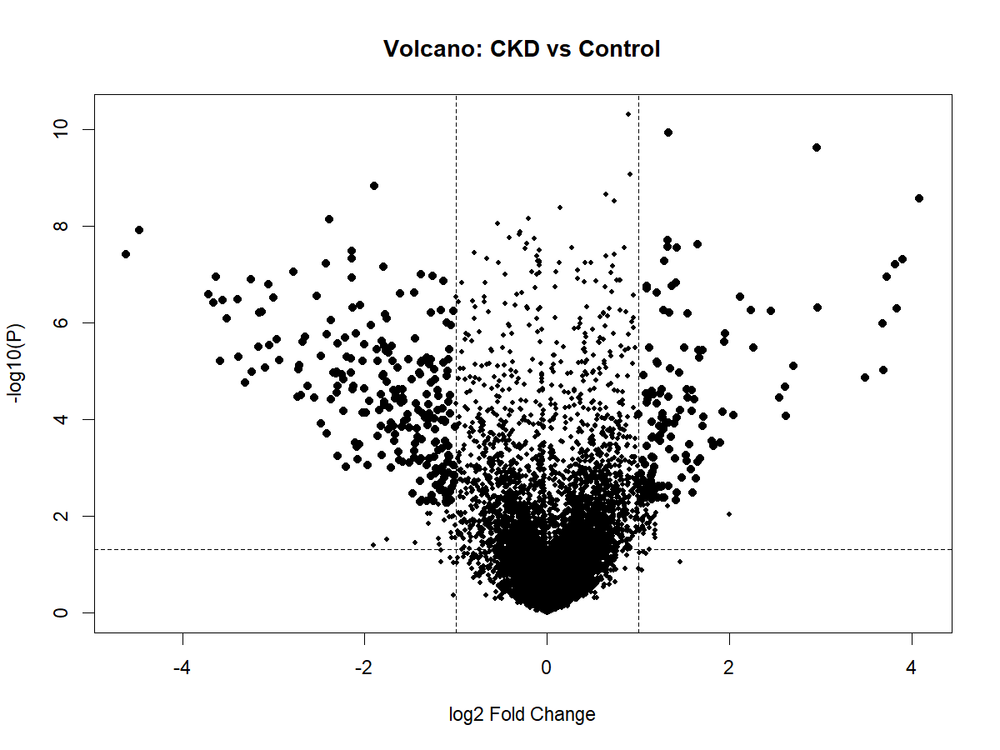

# Análisis Transcriptómico Reproducible de la Enfermedad Renal Crónica (ERC)

## Trabajo Fin de Máster (TFM) – Máster Universitario en Bioinformática

### Repositorio asociado al Trabajo Fin de Máster

Este repositorio contiene el código fuente, la documentación técnica, los resultados reproducibles y los materiales complementarios utilizados para el desarrollo del Trabajo Fin de Máster (TFM) del Máster Universitario en Bioinformática de la Universidad Alfonso X el Sabio (UAX).

Su finalidad es garantizar la reproducibilidad computacional, la trazabilidad metodológica y la verificación independiente de los resultados presentados en la memoria final.

**Autor:** Cristian Arias, MD

**Universidad:** Universidad Alfonso X el Sabio (UAX)

**Repositorio GitHub:** https://github.com/broncox456/tfm-erc-transcriptomica

---

# Descripción General

Este repositorio contiene el pipeline bioinformático reproducible desarrollado para el Trabajo Fin de Máster (TFM) titulado:

**"Análisis transcriptómico de la enfermedad renal crónica mediante datos públicos de microarrays: identificación de genes diferencialmente expresados y enriquecimiento funcional".**

El objetivo principal es identificar firmas transcriptómicas asociadas a la enfermedad renal crónica (ERC) e interpretar sus mecanismos biológicos mediante análisis de expresión diferencial y enriquecimiento funcional.

El proyecto ha sido desarrollado siguiendo principios de:

* Reproducibilidad computacional.
* Ciencia abierta.
* Trazabilidad de resultados.
* Documentación metodológica.
* Buenas prácticas en bioinformática.

---

# Descripción del Dataset

**Fuente:** Gene Expression Omnibus (GEO)

**Acceso GEO:** GSE12682

**Plataforma:** GPL571 – Affymetrix Human Genome U133A 2.0 Array

**Tipo de muestra:** Tejido renal humano

**Comparación biológica:** Enfermedad Renal Crónica (ERC) vs Controles

## Distribución de muestras

| Grupo     |  n |
| --------- | -: |
| ERC       | 23 |
| Controles | 29 |
| Total     | 52 |

## Resumen del procesamiento

| Métrica                           |        Valor |
| --------------------------------- | -----------: |
| Probes iniciales                  |       22,277 |
| Genes tras procesamiento          |       13,631 |
| Genes diferencialmente expresados |          365 |
| Umbral estadístico                |   FDR ≤ 0.05 |
| Umbral biológico                  | |log2FC| ≥ 1 |

---

# Objetivo Científico

La enfermedad renal crónica constituye un importante problema de salud pública mundial y se caracteriza por mecanismos moleculares complejos que no siempre son detectables mediante marcadores clínicos convencionales.

Este proyecto utiliza transcriptómica y bioinformática para identificar alteraciones moleculares asociadas a la progresión de la ERC y generar hipótesis biológicas susceptibles de validación futura.

---

# Flujo General del Pipeline

1. Descarga de datos desde GEO.
2. Curación y organización de metadatos.
3. Normalización mediante RMA.
4. Control de calidad.
5. Análisis de Componentes Principales (PCA).
6. Expresión génica diferencial mediante limma.
7. Corrección por comparaciones múltiples (Benjamini–Hochberg).
8. Enriquecimiento funcional GO y KEGG.
9. Generación automática de figuras y tablas.
10. Auditoría de reproducibilidad.

---

# Resultados Generados

## Figura representativa

### Análisis de Componentes Principales (PCA)

El análisis PCA permitió evaluar la estructura global del dataset y verificar la distribución de las muestras según los grupos biológicos estudiados.




### Expresión génica diferencial

El volcano plot resume simultáneamente la magnitud de los cambios de expresión génica y su significación estadística, mostrando genes sobreexpresados e infraexpresados en la enfermedad renal crónica.


---

# Reproducibilidad

Este proyecto incorpora:

* Gestión de dependencias mediante `renv`.
* Registro de versiones mediante `renv.lock`.
* Scripts modulares documentados.
* Archivos de configuración.
* Registros de ejecución (logs).
* Exportación de `sessionInfo`.
* Auditoría automática de resultados.
* Documento de trazabilidad de outputs.

---

# Trazabilidad de Resultados

La relación entre cada resultado generado y el script responsable de producirlo se encuentra documentada en:

```text
docs/output_traceability.md
```

---

# Hallazgos Principales

* Activación inflamatoria crónica.
* Remodelado de matriz extracelular.
* Procesos profibróticos.
* Alteraciones metabólicas tubulares.
* Disfunción epitelial renal.

Principales rutas enriquecidas:

* ECM-Receptor Interaction.
* Focal Adhesion.
* TGF-beta Signaling Pathway.
* PI3K-Akt Signaling Pathway.

---

# Limitaciones

* Dependencia de la calidad de los metadatos GEO.
* Posibles batch effects residuales.
* Limitaciones inherentes a microarrays.
* Ausencia de resolución unicelular.
* Ausencia de validación experimental externa.
* Ausencia de inferencia causal.
* Ausencia de validación clínica prospectiva.

---

# Nota sobre Archivos Legacy

El archivo:

```text
archive/legacy_analysis.R
```

corresponde a una versión exploratoria previa y no forma parte del pipeline final reproducible utilizado en este TFM.

---

# Autor

**Cristian Arias, MD**

Nefrólogo · Internista · Analista de Datos en Salud

Máster Universitario en Bioinformática

Universidad Alfonso X el Sabio (UAX)

República Dominicana


